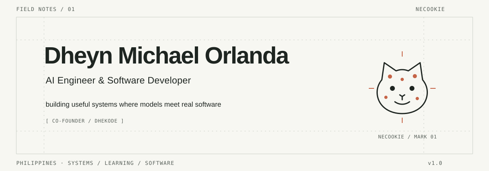
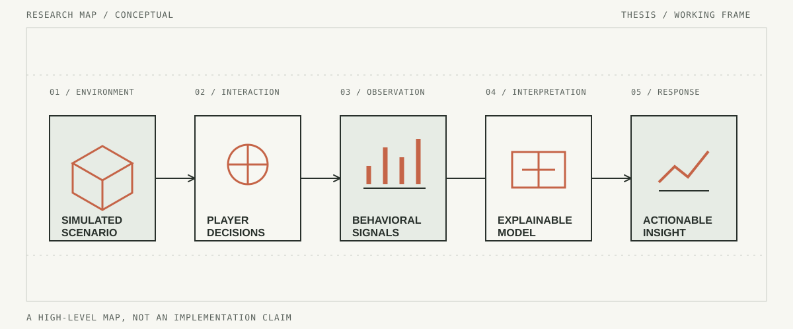

<picture>
  <source media="(prefers-color-scheme: dark) and (max-width: 600px)" srcset="./assets/readme/field-notes-mobile-dark.svg">
  <source media="(prefers-color-scheme: light) and (max-width: 600px)" srcset="./assets/readme/field-notes-mobile-light.svg">
  <source media="(prefers-color-scheme: dark)" srcset="./assets/readme/field-notes-dark.svg">
  <source media="(prefers-color-scheme: light)" srcset="./assets/readme/field-notes-light.svg">
  
</picture>

## Field note 01: practice

I’m Dheyn Michael Orlanda, also known as **Necookie**. I’m an AI Engineer and Software Developer based in the Philippines, and co-founder at DheKode.

I care about the parts between a promising model and a dependable system: evaluation, interfaces, data paths, clear failure modes, and the software that makes an idea useful outside a notebook.

## Current research

**Minecraft-Based Disaster Preparedness Simulation with Behavioral Analytics and Explainable Artificial Intelligence**

My thesis explores Minecraft as a setting for disaster-preparedness simulation, behavioral analysis, and interpretable AI-assisted insight. The map below is a conceptual research frame, not a claim about a finished implementation.

<picture>
  <source media="(prefers-color-scheme: dark) and (max-width: 600px)" srcset="./assets/readme/research-map-mobile-dark.svg">
  <source media="(prefers-color-scheme: light) and (max-width: 600px)" srcset="./assets/readme/research-map-mobile-light.svg">
  <source media="(prefers-color-scheme: dark)" srcset="./assets/readme/research-map-dark.svg">
  <source media="(prefers-color-scheme: light)" srcset="./assets/readme/research-map-light.svg">
  
</picture>

## Working set

| Area | Tools I reach for |
| :-- | :-- |
| AI engineering | Python, PyTorch, TensorFlow, Hugging Face |
| Applications | TypeScript, React, Next.js, FastAPI, Node.js |
| Systems | PostgreSQL, Redis, Docker, Linux, Git |
