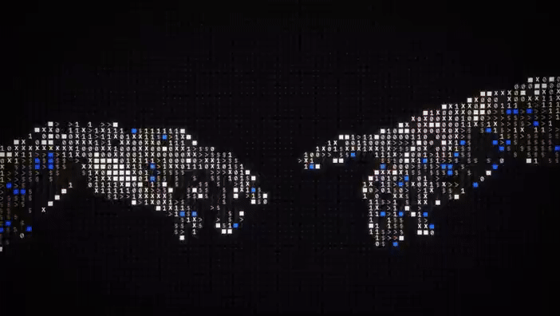
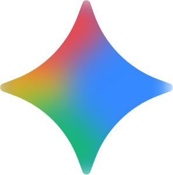
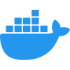

<!-- Profile README — theme-friendly (works in both light & dark mode) -->

<p align="center">
  
</p>

```text
      |\      _,,,---,,_
     /,`.-'`'    -.  ;-;;,_    Dheyn · AI Engineer
    |,4-  ) )-,_..;\ (  `'-'   co-founder @ DheKode
   '---''(_/--'  `-'\_)        building LLM products & AI SaaS, fast

   Python · TypeScript · PyTorch · FastAPI  ·  Philippines 🌏  ·  necookie.dev
```

<p align="center">
  
</p>

<p align="center">
  <a href="https://necookie.dev"></a>
  <a href="https://www.linkedin.com/in/dheyn-michael-orlanda-35b6b931b/"></a>
  <a href="mailto:dheyn.main@gmail.com"></a>
  <a href="https://instagram.com/nkm_119/"></a>
</p>

<p align="center">
  
</p>

```text
──────────────────────────── ⟢ about ⟣ ────────────────────────────
```

### About me

- 🌱 &nbsp;Exploring Minecraft as a platform for AI-enhanced disaster-risk simulation and adaptive education
- 💼 &nbsp;Open to **internships** and collaborations

### Tech stack

<p align="center">
  <b>AI & Machine Learning</b><br>
  <a href="https://pytorch.org" target="_blank"></a> &nbsp;
  <a href="https://tensorflow.org" target="_blank"></a> &nbsp;
  <a href="https://huggingface.co" target="_blank"></a> &nbsp;
  <a href="https://openai.com" target="_blank"></a> &nbsp;
  <a href="https://claude.ai" target="_blank"></a> &nbsp;
  <a href="https://deepseek.com" target="_blank"></a> &nbsp;
  <a href="https://gemini.google.com" target="_blank"></a>
</p>

<p align="center">
  <b>Languages</b><br>
  <a href="https://www.python.org" target="_blank"></a> &nbsp;
  <a href="https://www.typescriptlang.org" target="_blank"></a> &nbsp;
  <a href="https://developer.mozilla.org/en-US/docs/Web/JavaScript" target="_blank"></a> &nbsp;
  <a href="https://www.gnu.org/software/bash" target="_blank"></a> &nbsp;
  <a href="https://developer.mozilla.org/en-US/docs/Web/HTML" target="_blank"></a> &nbsp;
  <a href="https://developer.mozilla.org/en-US/docs/Web/CSS" target="_blank"></a>
</p>

<p align="center">
  <b>Frameworks & Full-Stack</b><br>
  <a href="https://fastapi.tiangolo.com" target="_blank"></a> &nbsp;
  <a href="https://nodejs.org" target="_blank"></a> &nbsp;
  <a href="https://react.dev" target="_blank"></a> &nbsp;
  <a href="https://nextjs.org" target="_blank"></a> &nbsp;
  <a href="https://astro.build" target="_blank"></a> &nbsp;
  <a href="https://tailwindcss.com" target="_blank"></a>
</p>

<p align="center">
  <b>Databases, Cloud & Tools</b><br>
  <a href="https://www.postgresql.org" target="_blank"></a> &nbsp;
  <a href="https://www.mongodb.com" target="_blank"></a> &nbsp;
  <a href="https://redis.io" target="_blank"></a> &nbsp;
  <a href="https://supabase.com" target="_blank"></a> &nbsp;
  <a href="https://www.docker.com" target="_blank"></a> &nbsp;
  <a href="https://www.linux.org" target="_blank"></a> &nbsp;
  <a href="https://git-scm.com" target="_blank"></a> &nbsp;
  <a href="https://www.postman.com" target="_blank"></a>
</p>

### Contribution snake

<p align="center">
  <picture>
    <source media="(prefers-color-scheme: dark)" srcset="https://raw.githubusercontent.com/Necookie/necookie/output/github-contribution-grid-snake-dark.svg" />
    <source media="(prefers-color-scheme: light)" srcset="https://raw.githubusercontent.com/Necookie/necookie/output/github-contribution-grid-snake.svg" />
    
  </picture>
</p>

### Dev quote of the day

<p align="center">
  
</p>

```text
   ╭─────────────────────────────────────────────────────────╮
   │   $ thanks for visiting — now go build something ☕      │
   ╰─────────────────────────────────────────────────────────╯
```
